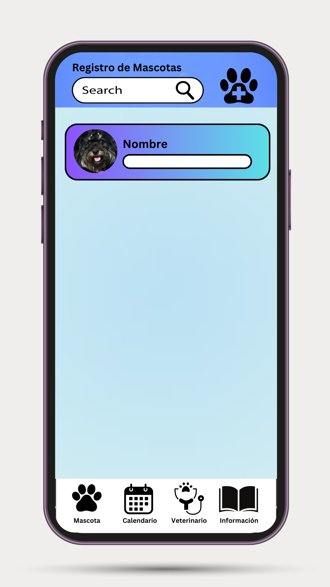
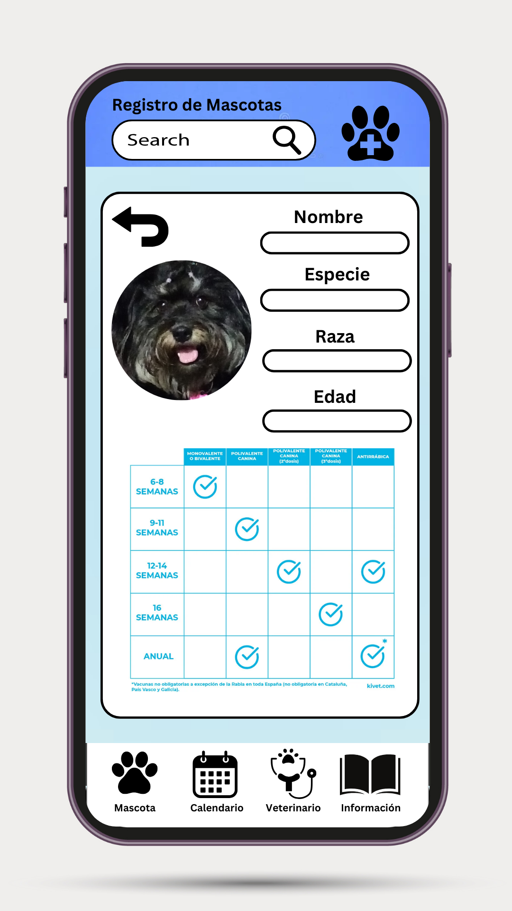
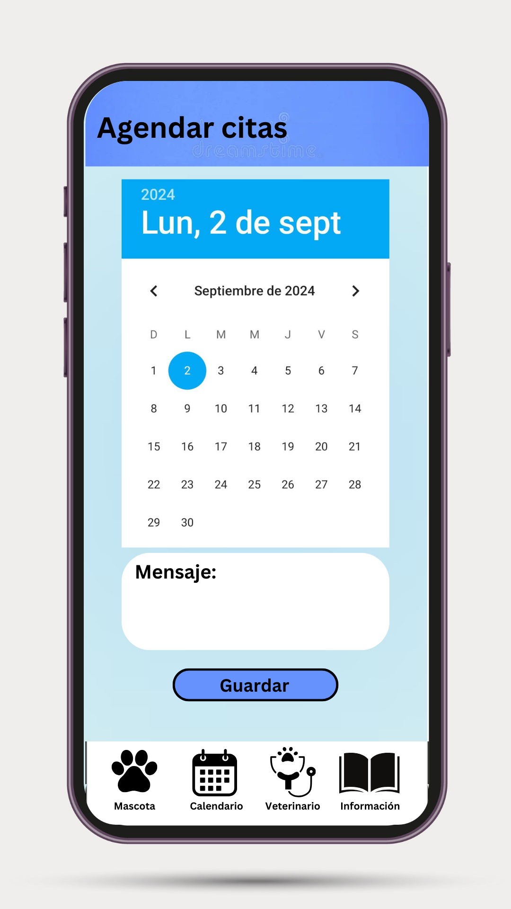
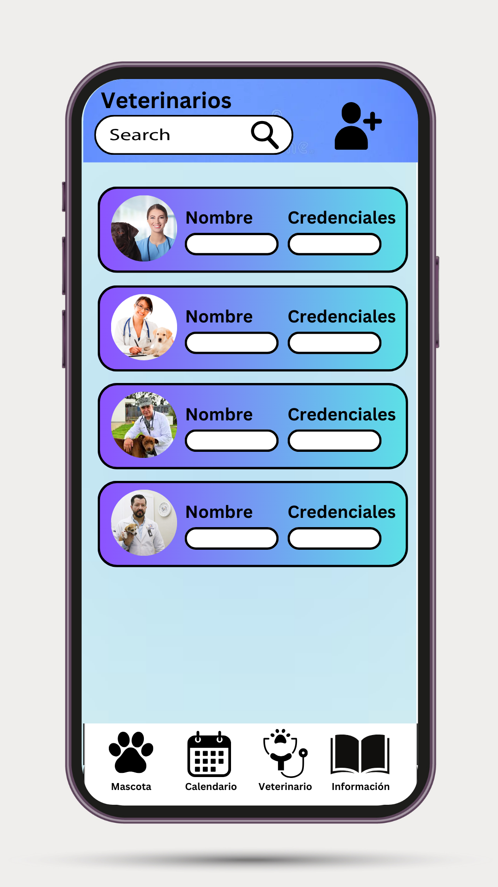
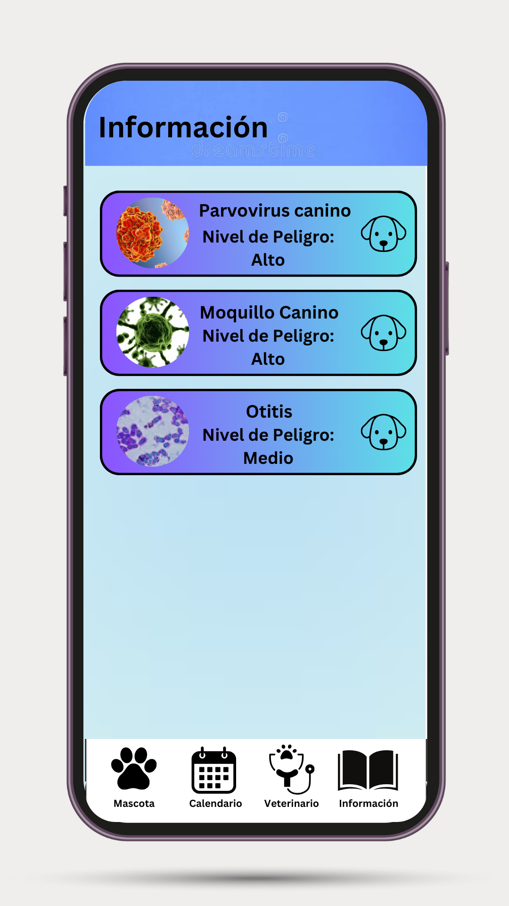

# Diseño de interfaz de usuario

La interfaz de usuario de la aplicación UANCasts esta inspirada en la interfaz de usuari de
aplicaicones similares y en el uso de [Material Design](https://material.io/design).

El diseño completoe esta disponible
en [Figma](https://www.figma.com/proto/hfzawvdC9umcC1e2z56fxR/PodcastsApp?node-id=1%3A2&scaling=scale-down)
. Los colores a usar estar[an basados en una combinación de escalas de gris. A continuación se
presentan las principales pantallas:

1. Lista de Mascotas

   Los usuarios de la aplicacion tendran un apartado para registrar a sus mascotas

   

2. Informacion y seguimiento

   Al seleccionar a una mascota registrada entrara a una interfaz que permitira mostrar la informacion medica de la mascota.

   

3. Calendario

   La aplicacion contara con un calendario para anotar citas o procedimientos de las mascotas.

   

4.
   

5.
   
