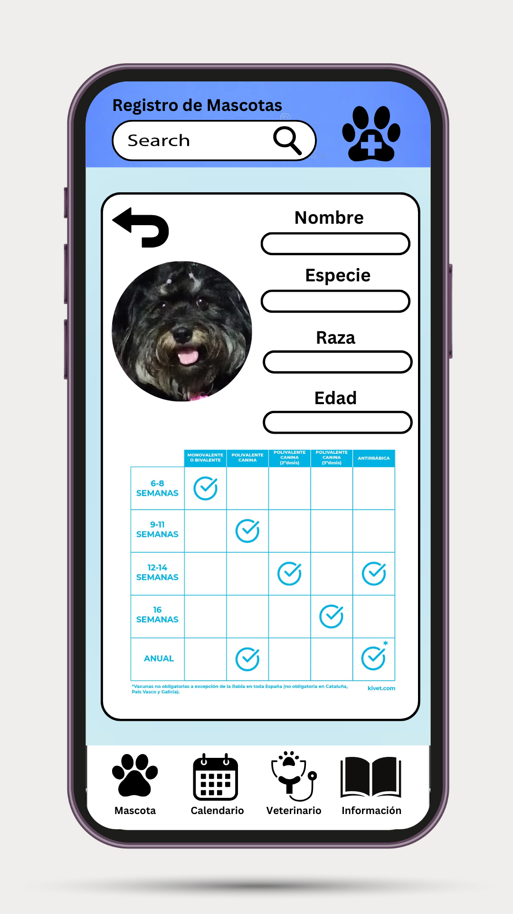
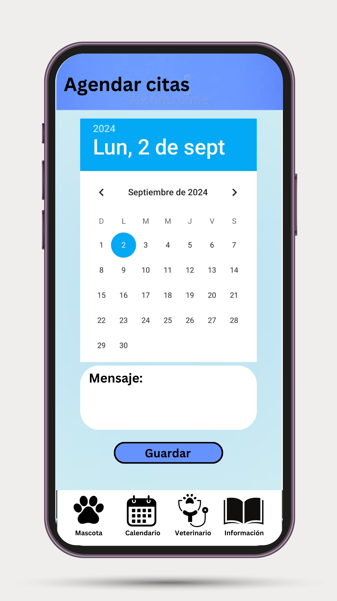
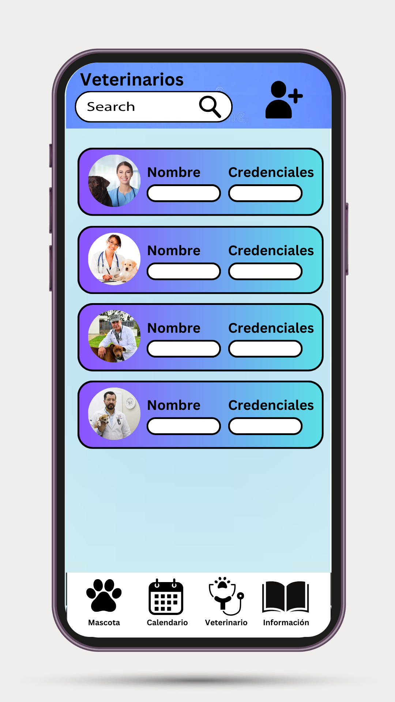
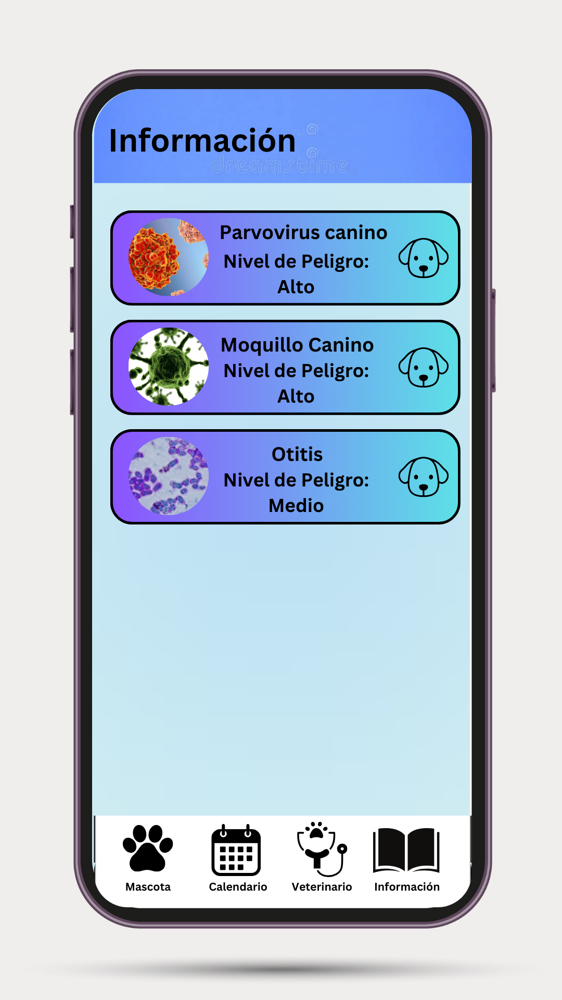

# Diseño de interfaz de usuario

La interfaz de usuario de la aplicación Vetlink esta inspirada en la interfaz de usuari de
aplicaicones similares.

El diseño completoe esta disponible
[aqui](https://marvelapp.com/prototype/32daa10g/screen/95463924)
A continuación se presentan las principales pantallas:

1. Lista de Mascotas

   Los usuarios de la aplicación tendrán un apartado para registrar a sus mascotas

   

2. Información y seguimiento

   Al seleccionar a una mascota registrada entrará a una interfaz que permitirá mostrar la información medica de la mascota.

   

3. Calendario

   La aplicación contara con un calendario para anotar citas o procedimientos de las mascotas.

   

4. Búsqueda de veterinarios

   La aplicación contara con un apartado que permita buscar y consultar veterinarios 

   

5. Información de enfermedades

   La aplicación contara con un apartado para ingresar los síntomas que presente una mascota y indagar cual podría ser el padecimiento 
   

